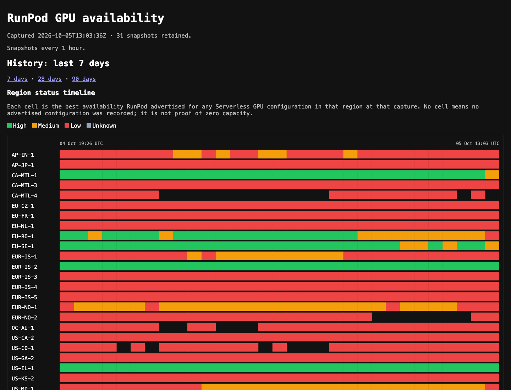

# RunPod GPU Availability

A tiny Rack dashboard that records the RunPod GPU catalog's **SERVERLESS**
availability by region and serves the latest snapshot plus selectable 7-, 28-,
and 90-day history.
It is intended to answer a practical question: which RunPod region/pool has
repeatedly had capacity for a Serverless workload?

## Dashboard

[](https://animesh-runpod-gpu-availability.fly.dev/)

## What it records

Every snapshot calls RunPod's documented catalog endpoint with
`include=AVAILABILITY&product=SERVERLESS`. Each row stores the timestamp,
region, GPU, serverless pool, VRAM, availability level, and serverless list
price. Availability is product-specific: Pod stock is not substituted for
Serverless stock.

## Local run

```sh
bundle install
DATABASE_PATH=tmp/availability.sqlite3 bundle exec ruby bin/migrate
RUNPOD_API_KEY=... DATABASE_PATH=tmp/availability.sqlite3 PORT=8080 bundle exec foreman start
open http://127.0.0.1:8080
```

`RUNPOD_API_KEY` needs read access to the RunPod REST v2 catalog. Foreman reads
the checked-in Procfile; the scheduler's sole job runs at the next UTC hour, so
there is deliberately no immediate capture at boot.

## Fly.io deployment

The checked-in `fly.toml` targets `animesh-runpod-gpu-availability`. A fork
should first change its `app` value to a unique Fly app name and create that app.

```sh
fly volumes create availability_data --size 1 --region sin
fly secrets set RUNPOD_API_KEY=...
fly deploy
```

The Fly Machine intentionally stays running: its scheduler process cannot collect
while stopped. SQLite data lives only on the `availability_data` volume.
For this low-cost decision tool, deleting that volume deletes the history; no
separate backup workflow is configured. Each Machine boot migrates that mounted
database before starting either application process. Capture-run diagnostics are
retained for 30 days.

## Verification

```sh
bundle exec rake test
curl -fsS https://YOUR_APP.fly.dev/healthz
open https://YOUR_APP.fly.dev/
```
